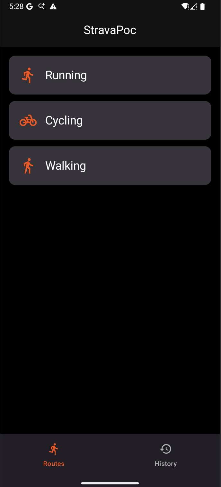
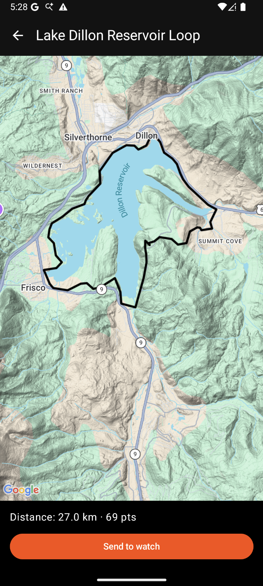
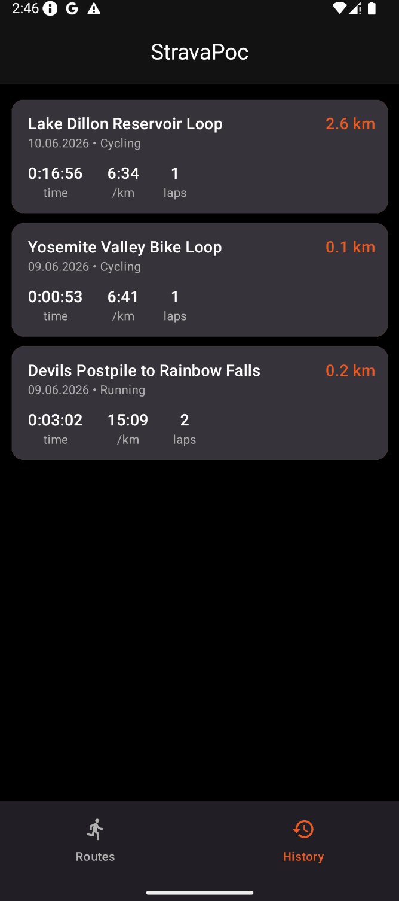
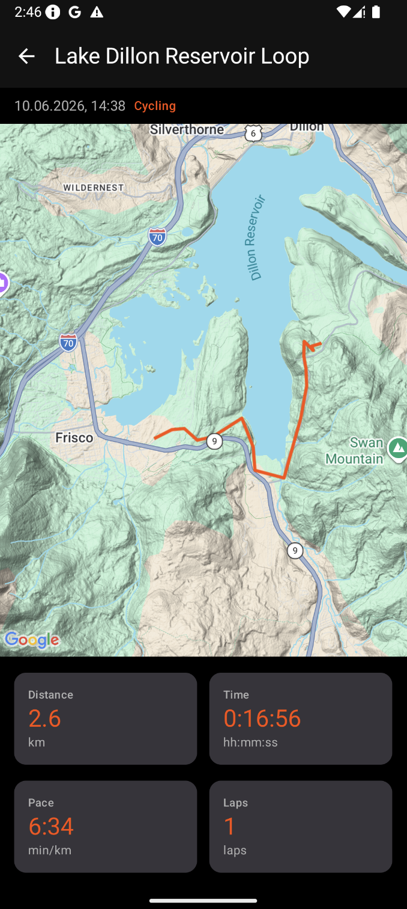
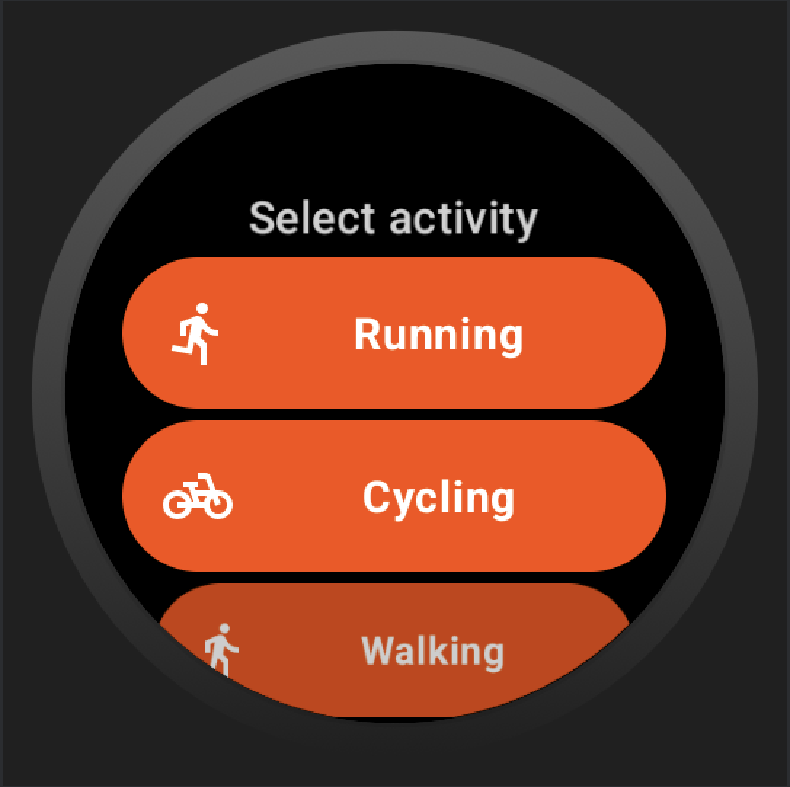
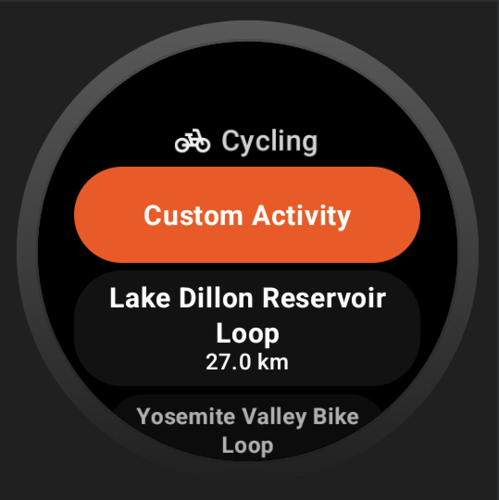
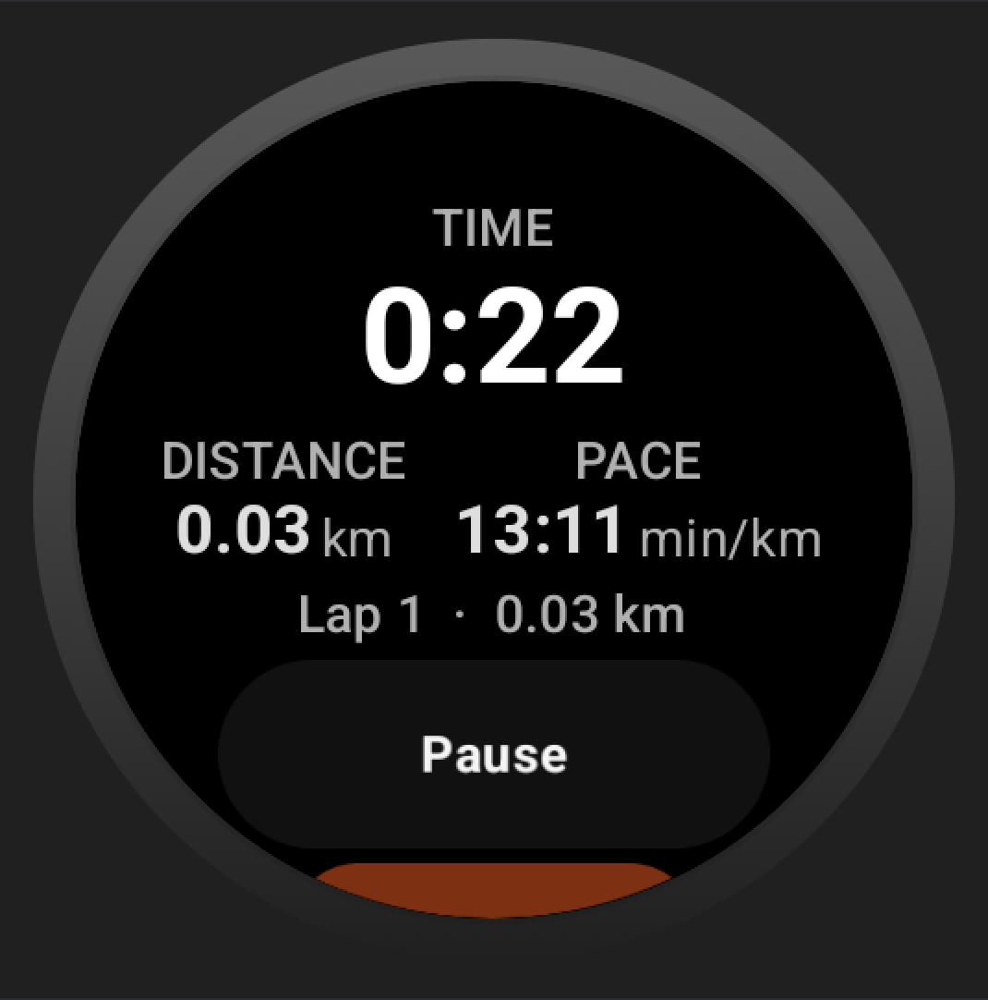
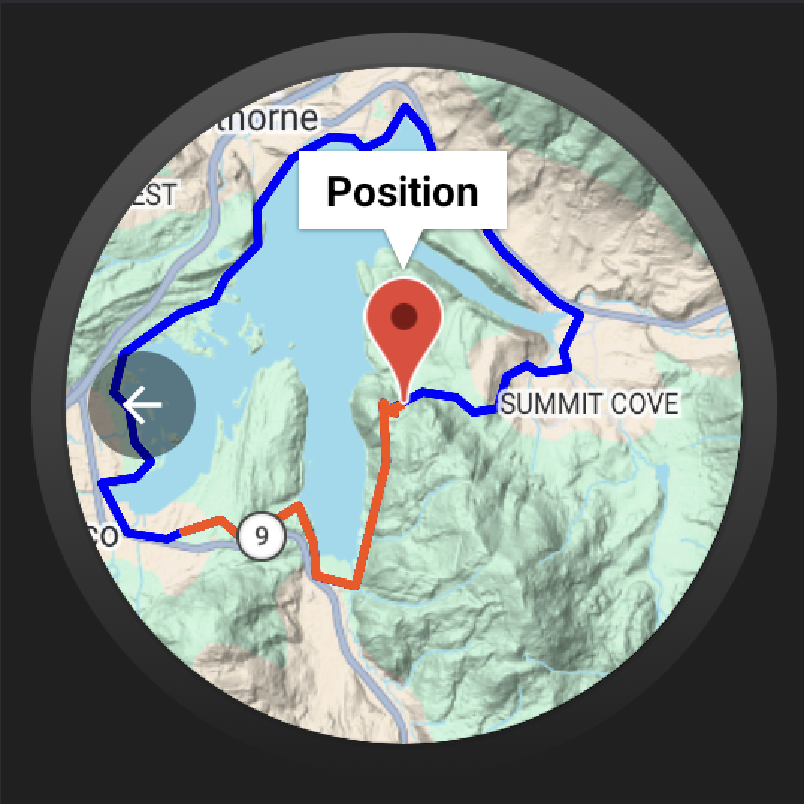
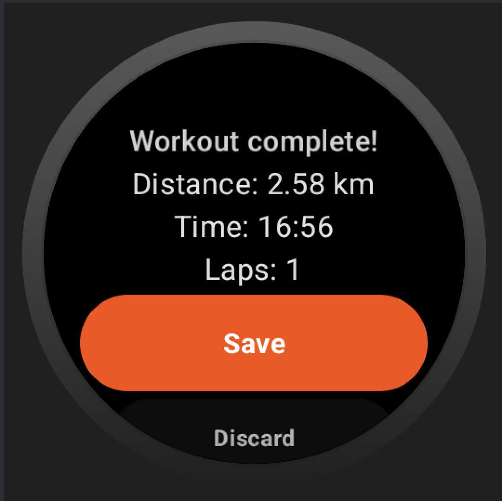

# StravaPoc

Android proof-of-concept inspired by Strava — a two-app system where a Wear OS watch records GPS workouts and syncs the results to a companion phone app.

**Phone**
<p>
  
  &nbsp;
  
  &nbsp;
  
  &nbsp;
  
</p>

**Wear OS**
<p>
  
  &nbsp;
  
  &nbsp;
  
  &nbsp;
  
  &nbsp;
  
</p>
<p>
  
</p>

---

## Table of Contents

- [Features — Phone App](#features--phone-app)
- [Features — Wear OS App](#features--wear-os-app)
- [Architecture](#architecture)
- [Tech Stack](#tech-stack)
- [Module Structure](#module-structure)
- [Phone ↔ Watch Sync](#phone--watch-sync)
- [Wear OS: Special Solutions](#wear-os-special-solutions)
- [Build & Run](#build--run)

---

## Features — Phone App

### Activity type selection
The entry point of the app. Three activity types are available: **Running**, **Cycling**, **Walking**. Each type has an icon and navigates to a filtered route list.

### Route list
Routes are filtered by the selected activity type. Each route card shows the name, distance, and type. Tapping a card opens the route detail view.

### Route detail
Displays the route polyline on a **Google Maps** `MapType.TERRAIN` map. A bottom card shows metadata (name, type, distance). The user can send the route to the paired watch with one tap.

### Workout history
A scrollable list of all workouts synced from the watch. Items are sorted by date and show the route name, activity type, date/time, and distance.

Supports **swipe-to-delete**: dragging a card left reveals a red delete icon. Releasing past a threshold shows a confirmation dialog. Cancelling snaps the card back with a spring animation.

### Workout detail
Opens when tapping a history item. Shows:
- A Google Maps polyline for both the original route and the actual GPS track recorded on the watch (different colors)
- Four metric tiles: **distance**, **duration**, **pace**, **lap count**
- Date and activity type label at the top

---

## Features — Wear OS App

### Activity selection
`ScalingLazyColumn`-based list of activity type chips. The ViewModel also checks for routes that have been sent from the phone via the Wearable Data Layer (both in the foreground listener and by querying existing `DataItems` on startup).

### Route list
Filtered by activity type. Shows routes stored in the local Room database. A "Custom (free)" chip at the top allows starting a workout without a predefined route — GPS tracking only, no route overlay.

### Workout screen
The core recording screen. It uses a **two-page `HorizontalPager`** with a `HorizontalPageIndicator`:

**Page 1 — Metrics:**
- Elapsed time (hh:mm:ss)
- Total distance (km)
- Current pace (min/km)
- Current lap number and lap distance
- Three action buttons: **Pause / Resume**, **Lap**, **Finish**

**Page 2 — Map:**
- Live GPS track rendered as a polyline
- Predefined route overlay in a contrasting colour
- A back button to return to the metrics page

The **Digital Crown** (rotary input) can also be used to scroll between pages.

**Pause / Resume** freezes the timer and location updates; the last known position is preserved so distance continues correctly after resuming.

**Lap** resets the lap distance counter while keeping the total.

**Finish** stops all jobs, downsizes the GPS track to ≤ 2 000 points (uniform sampling), and navigates to the summary screen.

### Ambient mode
When the watch enters ambient mode, the full workout UI is replaced by a minimal **always-on screen** that shows only elapsed time and total distance in large text on a black background. This reduces battery drain during long workouts while keeping key metrics visible. The transition is driven by `AmbientLifecycleObserver` — see [Wear OS: Special Solutions](#wear-os-special-solutions).

### Workout summary
Displays the final distance, total time, and lap count. Two actions are available:
- **Save** — serialises the result and sends it to the phone via the Wearable Data Layer. If the phone is not reachable, the result is stored locally and retried later. A brief snackbar reports whether the sync succeeded or was queued.
- **Discard** — shows a confirmation sub-screen before deleting the result.

### Crash / restart recovery
Active workout state is persisted to `SharedPreferences` (`WorkoutPreferences`) before the workout starts. If the app process is killed, `MainActivity` detects the active route ID on the next launch and navigates straight to the workout screen, binding to the already-running foreground service.

---

## Architecture

The project uses the **MVI (Model–View–Intent)** pattern throughout.

```
Screen (Composable)
  │  collectAsState / collectSideEffect
  ▼
ViewModel  (MviViewModel<STATE>)
  │  launch {}  →  transform {}  /  emitSideEffect {}
  ▼
UseCase
  ▼
Repository
  ▼
LocalDataSource
  ▼
Room DAO / DataClient / LocationSource
```

### MviViewModel

All ViewModels extend `MviViewModel<STATE>` from `:core:architecture`. The base class provides:

| API | Purpose |
|-----|---------|
| `launch {}` | Coroutine scope with the shared exception handler |
| `transform {}` | Atomic state update (runs on the MVI state machine) |
| `emitSideEffect(value)` | One-time events: navigation, toasts, etc. |
| `viewState: StateFlow<STATE>` | Current UI state |
| `sideEffect: SharedFlow<Any>` | Side-effect bus, filtered at the call site with `filterIsInstance<T>()` |

**Rule:** `viewModelScope.launch {}` is never used in ViewModels. All coroutines go through `launch {}`.

### State machine — Workout

The workout state is a sealed class flowing from `WorkoutService` → `WorkoutViewModel` → `WorkoutScreen`:

```
Idle  ──start──▶  Active  ──pause──▶  Paused
                    │                   │
                    └──────resume───────┘
                    │
                  finish
                    │
                    ▼
                 Finished  ──▶  Summary screen
```

---

## Tech Stack

| Area | Library | Version |
|------|---------|---------|
| Language | Kotlin | 2.0.21 |
| UI — Phone | Jetpack Compose (BOM) | 2024.09.00 |
| UI — Wear | Wear Compose Material | 1.2.1 |
| Navigation — Phone | Navigation Compose | 2.9.0 |
| Navigation — Wear | Wear Compose Navigation (`SwipeDismissableNavHost`) | 1.4.0 |
| DI | Hilt | 2.51.1 |
| Database | Room + KSP | 2.7.1 / 2.0.21-1.0.28 |
| Serialisation | kotlinx.serialization JSON | 1.7.3 |
| Coroutines | kotlinx.coroutines | 1.8.1 |
| Maps | Maps Compose | 4.4.1 |
| Location | Play Services Location (FusedLocationProvider) | 21.3.0 |
| Watch sync | Play Services Wearable (DataClient) | 20.0.1 |
| Ongoing Activity | androidx.wear:wear-ongoing | 1.0.0 |
| Ambient mode | androidx.wear:wear | 1.3.0 |
| Splash screen | Core Splashscreen | 1.0.1 |

---

## Module Structure

```
:core:architecture      MVI base classes (MviViewModel, MviContainer, MviConfig)
:library:data           Domain models, DAOs, Room databases, repositories, DI bindings
:library:usecase        All use cases — depend only on :library:data interfaces
:app                    Phone UI, sync receivers, Google Maps integration
:wear                   Wear OS UI, WorkoutService, location sources, data sync senders
```

Dependency direction (one-way):

```
:app  ─────────────────────────────────────────────────────────────────────┐
                                                                           │
:wear ─────────────────────────────────────────────────────────────────────┤
                                                                           ▼
                                                              :library:usecase
                                                                           │
                                                                           ▼
                                                              :library:data
                                                                           │
                                                                           ▼
                                                              :core:architecture
```

Neither `:app` nor `:wear` depends on the other.

### Avoiding Hilt `DuplicateBindings`

The phone and watch need different `RouteRepository` implementations (mock data vs. Room). To keep a single Hilt component without conflicts, the wear module uses a **subinterface**:

```
RouteRepository          ←── bound to RouteRepositoryImpl       (mock, used by :app)
WearRouteRepository      ←── bound to WearRouteRepositoryImpl   (Room, used by :wear)
  : RouteRepository
```

Wear-only use cases (`GetWearRoutesUseCase`, `GetWearRouteByIdUseCase`) inject `WearRouteRepository` directly, while the phone uses the base `GetRoutesUseCase(RouteRepository)`.

---

## Phone ↔ Watch Sync

Communication uses the **Wearable Data Layer API** (`DataClient.putDataItem` / `deleteDataItems`). All payloads are JSON-serialised with kotlinx.serialization.

### Phone → Watch: route delivery

```
RouteDetailScreen
  └─ RouteSender.send(route)
       └─ WearSyncManager.putDataItem("/route/selected", routeJson, urgent=true)
```

On the watch side, routes are received in two places to cover both app states:

| Situation | Receiver |
|-----------|----------|
| App is open | `ActivitySelectionViewModel` — foreground `DataClient.OnDataChangedListener` |
| App is in background / killed | `RouteReceiver` — `WearableListenerService` |

Both receivers persist the route to Room and delete the `DataItem` from the layer.

### Watch → Phone: workout result delivery

```
WorkoutSummaryScreen → onSave()
  └─ WorkoutResultSender.sendResult(result)
       ├─ phone reachable  → putDataItem("/workout/result", resultJson, urgent=true) ✓
       └─ phone offline    → save PendingWorkoutResultEntity to Room
                               └─ retry on: app start  /  onPeerConnected
```

On the phone, `WorkoutResultReceiver` (`WearableListenerService`) receives the result, enriches it with the route name and activity type from the local repository, saves it to Room, shows a notification, and deletes the `DataItem`.

---

## Wear OS: Special Solutions

### OngoingActivity

During an active workout, a persistent indicator appears in the watch face complications area — even when the user navigates away from the app. This is implemented using the `androidx.wear.ongoing.OngoingActivity` API.

`WorkoutService.buildNotification()` builds two parallel representations of the timer:

- **Running:** `Status.StopwatchPart` — the system renders a live counting stopwatch in the complication.
- **Paused:** `Status.TextPart` — a static formatted time string is displayed instead.

```kotlin
val ongoingActivity = OngoingActivity.Builder(context, NOTIFICATION_ID, notificationBuilder)
    .setStaticIcon(R.drawable.ic_run)
    .setTouchIntent(pendingIntent)   // tap → return to workout screen
    .setStatus(statusBuilder.build())
    .build()
ongoingActivity.apply(applicationContext)
```

The `OngoingActivity` is automatically removed when `ServiceCompat.stopForeground` is called at workout finish.

### Ambient mode

`MainActivity` registers an `AmbientLifecycleObserver` as a `LifecycleObserver`. Callbacks update a `mutableStateOf<Boolean>` that is passed down the composition tree to `WorkoutScreen`:

```kotlin
override fun onEnterAmbient(ambientDetails: AmbientDetails) { isAmbient.value = true }
override fun onExitAmbient()                                { isAmbient.value = false }
```

`WorkoutScreen` switches between two composables based on this flag:

```kotlin
if (isAmbient) {
    AmbientWorkoutScreen(elapsedSeconds, distanceKm)   // minimal, black bg, large text
} else {
    WorkoutPager(...)                                  // full interactive UI
}
```

The ambient screen intentionally has no buttons or interactive elements to avoid accidental input when the wrist is lowered.

### Foreground service + WakeLock

`WorkoutService` is a foreground service (`FOREGROUND_SERVICE_TYPE_LOCATION`) with `START_STICKY`. A `PowerManager.PARTIAL_WAKE_LOCK` is acquired for up to 4 hours to keep the CPU running while GPS and the timer are active. The lock is released on finish or in `onDestroy`.

`WorkoutViewModel` binds to the service with `BIND_AUTO_CREATE` and mirrors the service's `StateFlow<WorkoutViewState>` into the MVI state, ensuring the UI reflects the service even if the Activity is recreated.

### Rotary / Digital Crown input

The workout pager handles rotary input with the `onRotaryScrollEvent` modifier on a `focusable` `HorizontalPager`. Positive vertical scroll moves to page 2 (map), negative scroll moves back to page 1 (metrics). Focus is requested in a `LaunchedEffect` to ensure the modifier receives events immediately.

### Swipe-to-dismiss navigation

The navigation host uses `SwipeDismissableNavHost` from `androidx.wear.compose.navigation`. Swiping from the left edge on any screen dismisses it and returns to the previous screen, matching the system gesture expected on Wear OS.

### GPS jitter filtering (per activity type)

Each activity type has a `TrackingConstraints` data class with three parameters:

| Parameter | Purpose |
|-----------|---------|
| `jitterKm` | Minimum movement to register as real displacement |
| `maxDeltaKm` | Maximum plausible single-step distance (spike rejection) |
| `mockSpeedKmh` | Speed used by `MockLocationSource` for predefined routes |

```
WALKING  →  jitter 3 m  /  max delta 100 m  /  mock  5 km/h
RUNNING  →  jitter 3 m  /  max delta 150 m  /  mock 10 km/h
CYCLING  →  jitter 5 m  /  max delta 250 m  /  mock 25 km/h
```

Distance between GPS fixes is computed with the **Haversine formula**.

### MockLocationSource

For predefined routes (phone-sent routes on the watch), `MockLocationSource` simulates movement along the route polyline at the activity-appropriate speed. It:
1. Pre-computes cumulative distances along the polyline.
2. Emits a new `RoutePoint` every second, linearly interpolated along the segment.
3. Supports resuming mid-route via `initialProgressKm`.

This allows full workout recording and testing without needing a real GPS signal.

### Pending sync queue

If the phone is not connected when the user saves a workout, `WorkoutResultSender` persists the serialised result in `PendingWorkoutResultEntity` (Room in `WearDatabase`). The retry loop runs:

- At app start (`WearApplication.onCreate`)
- When the phone re-connects (`RouteReceiver.onPeerConnected`)

---

## Build & Run

### Requirements

- Android Studio Iguana or newer
- Wear OS emulator or physical Wear OS 3+ device paired with an Android 9+ phone
- Google Play Services on both devices (required for Wearable Data Layer)

### Build commands

```bash
# Fast compile check — all modules
./gradlew :library:data:compileDebugKotlin \
          :library:usecase:compileDebugKotlin \
          :app:compileDebugKotlin \
          :wear:compileDebugKotlin

# Full debug build
./gradlew assembleDebug

# Unit tests
./gradlew test

# Install phone app
./gradlew :app:installDebug

# Install watch app
./gradlew :wear:installDebug
```

### Permissions

| Permission | Required by |
|------------|-------------|
| `ACCESS_FINE_LOCATION` | GPS tracking (Wear) |
| `ACCESS_COARSE_LOCATION` | GPS fallback (Wear) |
| `FOREGROUND_SERVICE` | WorkoutService (Wear) |
| `FOREGROUND_SERVICE_LOCATION` | WorkoutService location type (Wear) |
| `WAKE_LOCK` | WakeLock during workout (Wear) |
| `POST_NOTIFICATIONS` | Sync + route notifications (both, Android 13+) |
